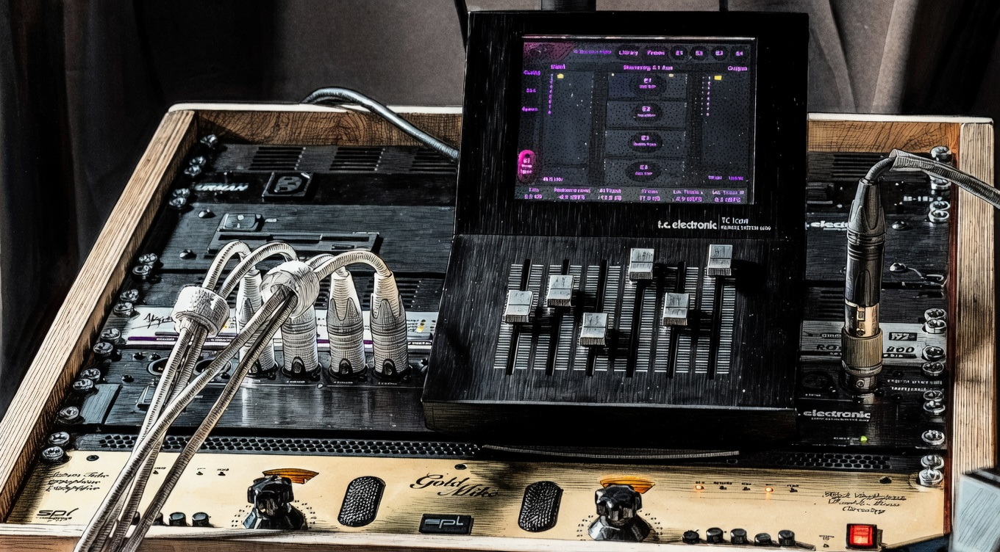

# YD Works — ydworks.de

## Проект
Персональный сайт аудио инженера Yegor Demchenko. Один файл index.html, деплой через Vercel + GitHub.

## Стек
- Чистый HTML/CSS/JS, ноль фреймворков
- Хостинг: Vercel (auto-deploy из main)
- Домен: ydworks.de (Porkbun)
- Репозиторий: github.com/ebymamash/ydworks-site

---

## Дизайн-система

```
--bg:   #000000
--text: #eeece8
--muted:#7a7875
accent-red:    #cc2020
accent-yellow: #c8a800
accent-blue:   #4a9eff
accent-green:  #4caf50
accent-grey:   #7a7875
```

- Шрифт везде: `'Lucida Console', 'Courier New', monospace` — Windows XP / 2005 era эстетика
- VT323 (Google Fonts) подключён но не используется в терминале
- Лого: `logo new.png` (badge PNG, referenced as `logo%20new.png`) — 140px wide, nav padding 3rem 1.5rem
- CRT рамка: crt-frame.png — Sony Trinitron Multiscan E450, `mix-blend-mode: screen` (чёрные пиксели прозрачны)

---

## Изображения

| Файл | Использование |
|---|---|
| `logo%20new.png` | Badge лого в nav, 140px |
| `hero16x9newest.jpeg` | Hero 16:9 (AI студия, 5508×3046) |
| `hero-photo.jpg` | Hero 4:3 (реальное фото студии, 2624×1968) |
| `hero-anime.jpg` | Hero 16:9 для кода `fms` (аниме студия, 5483×3060) |
| `hero-anime-4x3.jpg` | Hero 4:3 для кода `fms` (ffmpeg crop 4080:3060:950:0) |
| `eva14-16x9.jpg` | Hero 16:9 для кода `eva14` (фокус на TC6000 экран) |
| `eva14.png` | Hero 4:3 для кода `eva14` (2304×1728) |
| `crt-frame.png` | CRT оверлей, mix-blend-mode: screen |

---

## HTML-структура

```html
<nav>                          <!-- position:absolute, top-left hero -->
  <a href="#"></a>
</nav>
<a class="start-btn" id="start-btn"> >Enter</a>   <!-- position:fixed, под лого -->
<div class="hero">
  
  
</div>
<div class="monitor-wrap">                        <!-- CRT секция -->
  <section id="terminal">
    <div id="term-wrap">
      <pre id="term-output"></pre><span id="term-cursor"></span>
    </div>
    <div id="term-footer">...</div>              <!-- юридика, position:absolute bottom -->
  </section>
      <!-- поверх терминала, mix-blend-mode:screen -->
  <!-- Mac OS 9 modal живёт здесь, внутри monitor-wrap, снаружи terminal -->
</div>
```

---

## Ключевые CSS правила

```css
/* Nav / Лого */
nav { padding: 3rem 1.5rem; }
nav img { display: block; width: 140px; height: auto; }
.start-btn { position: fixed; top: calc(3rem + 60px + 1.8rem); left: 2rem; font-size: 1.8rem; z-index: 10; }

/* Hero — два изображения, переключаются по aspect-ratio */
.hero { width: 100%; height: 100vh; position: relative; overflow: hidden; }
.hero-video { display: none; }
@media (min-aspect-ratio: 16/9) {
  .hero-video { display: block; }
  .hero-static { display: none; }
}
/* Ken Burns + vignette */
.hero-static, .hero-video { animation: kenburns 30s ease-in-out infinite; }
.hero::after { content:''; position:absolute; inset:0;
  background: radial-gradient(ellipse at center, transparent 50%, rgba(0,0,0,0.5) 100%);
  animation: vignette-pulse 8s ease-in-out infinite; pointer-events:none; z-index:1; }

/* Монитор */
.monitor-wrap { position: relative; width: 100%; background: #000; z-index: 2; margin-top: -2px; }
.crt-frame { display: block; width: 100%; mix-blend-mode: screen; pointer-events: none; position: relative; z-index: 2; }

/* Терминал */
#terminal {
  display: flex; flex-direction: column; align-items: center; justify-content: flex-start;
  position: absolute; top: 0; left: 0; width: 100%; height: 100%;
  background: #000;
  padding: 21% 10% 3% 10%;        /* дефолт — интро */
  font-family: 'Lucida Console', 'Courier New', monospace;
  font-size: clamp(0.8rem, 1.4vw, 1.6rem);
  line-height: 1.4;
  overflow: clip;                  /* ВАЖНО: не hidden! hidden создаёт scroll-контейнер */
  overflow-anchor: none;
  z-index: 1;
  animation: term-glitch 16s step-end infinite;
}
/* Три состояния padding-top: */
#terminal.main-menu { padding-top: 75%; }   /* главное меню */
#terminal.submenu   { padding-top: 13%; }   /* [WHAT ARE YOU?] */
/* дефолт 21% = интро */

/* Мобайл ≤430px */
@media (max-width: 430px) {
  #terminal { padding-top: 45%; padding-bottom: 12%; font-size: 0.82rem; }
  #terminal.main-menu { padding-top: 75%; }
  #terminal.submenu { padding-top: 5%; padding-bottom: 36%; justify-content: flex-end; font-size: 0.7rem; overflow: hidden; }
  #terminal.submenu .term-btn { font-size: 0.82rem; }
  #terminal.submenu #term-wrap { max-height: 68vh; overflow-y: auto; -webkit-overflow-scrolling: touch; }
}
/* Высокие телефоны (≤430px + ≥800px высота) */
@media (max-width: 430px) and (min-height: 800px) {
  #terminal { padding-top: 60%; }
  #terminal.submenu { padding-bottom: 52%; }
}

/* Инпут ENTER CODE */
.term-input { background:none; border:none; outline:none; font:inherit; color:inherit; width:15ch; caret-color:var(--text); }
.term-input.bingo::placeholder { color: #4caf50; }
.term-input.error::placeholder { color: #cc2020; }
```

---

## JS — архитектура

### Глобальные переменные
```javascript
let started = false;
let skipped = false;
let introDone = false;
let typingGen = 0;
const visitedSections = new Set();
let navItems = [];
let navIndex = 0;
let inEnterCode = false;
```

### Клавиши
```
Enter (до старта)      → startBtn.click()
Enter (после интро)    → navItems[navIndex].btn.click()
↑ / ↓                  → setNavIndex()
Space (во время интро) → showFull() + мгновенный скролл
Space (после интро)    → skipped = true (всё последующее instant)
Escape (в ENTER CODE)  → showMainMenu()
```

### Padding классы (JS-управление)
- `navigateTo`: `.remove('main-menu')`, если target==='WHAT ARE YOU?' → `.add('submenu')` иначе `.remove('submenu')`
- `handleEnterCode`: `.add('main-menu')`
- `showMainMenu`: `.remove('submenu')`, `.add('main-menu')`

### ENTER CODE — feedback анимация
4 флеша (120мс вкл/выкл), последний держится ~800мс (до 1520мс от старта).
- Бинго: `inp.classList.add('bingo')` на 4-м флеше → placeholder зелёный
- Ошибка: `inp.classList.add('error')` на 4-м флеше → placeholder красный
- После сброса: `inp.style.width = ''`, `h()`, `inp.focus()`
- Инпут/кнопки никогда не убираются — можно вводить коды последовательно

### Mac OS 9 modal — drag
- `dragLast = {x, y}` delta-метод
- На mousedown: `macModal.style.transform = 'none'`, вычислить `left/top` в px относительно `termEl`
- На open: `macModal.style.left = ''`, `top = ''`, `transform = ''`
- Bounds: bL=bR=9%, bT=14.75%, bB=10% от размеров termEl

---

## Контент терминала

### introLines
```
BOOTING...
LOADING SELF...
REASON FOR INTRUSION: UNKNOWN
RUNNING DIAGNOSTICS...
Diagnosis failed
DEFINING IDENTITY...
...
OH.
IDENTITY CONFIRMED: a GUEST
WHAT want you?
[пустая строка]
```

### Меню (sectionMenus)
- `intro`: [WHAT ARE YOU?, YD-WORKS, MASTERING, COMMIT FILES, CONTACT, ENTER CODE]
- `main`: [YD-WORKS, MASTERING, COMMIT FILES, CONTACT, ENTER CODE]
- `WHAT ARE YOU?`: то же что main
- `YD-WORKS`: [AUDIO, DIGITAL, AI, OPERATOR, BACK→main]
- `MASTERING`: [WHAT IS MASTERING?, THE PROCESS, SPECS & DELIVERY, PRICING, BACK→main]
- `COMMIT FILES`, `CONTACT`: [BACK→main]
- Подпункты YD-WORKS и MASTERING: [BACK→родитель]

### Цвета скобок кнопок
```
YD-WORKS:     #cc2020 (красный)
MASTERING:    #c8a800 (жёлтый)
COMMIT FILES: #4a9eff (синий)
CONTACT:      #4caf50 (зелёный)
ENTER CODE:   #7a7875 (серый)
```
Подпункты YD-WORKS / MASTERING — весь текст кнопки #c8a800.

### ENTER CODE
```
ARE YOU UP TO SOMETHING?
> [input]
[Esc]  [Enter]
space click = animation skip / tap 3× on mobile
```
Коды:
- `fms` → меняет hero на аниме студию (hero-anime.jpg / hero-anime-4x3.jpg)
- `eva14` → меняет hero на eva14 (eva14-16x9.jpg / eva14.png)
- `cv01` → открывает Mac OS 9 modal с CV (тёмный вариант `.cv`)

---

## Mac OS 9 modal

Живёт внутри `#terminal` (z-index 8). CRT frame (`mix-blend-mode: screen`) естественно оверлеит его.

```css
.mac-modal { position:absolute; top:18%; left:50%; transform:translateX(-50%);
  width:64%; z-index:8; border:2px solid; border-color:#e0ddd8 #444 #444 #e0ddd8; }
.mac-titlebar { background: repeating-linear-gradient(180deg, #ccc8c0 0px,#ccc8c0 1px,#a0a09a 1px,#a0a09a 2px); cursor:grab; }
.mac-body { background:#fff; color:#111; padding:16px 22px 22px; max-height:74vh; }
/* CV dark variant */
.mac-modal.cv .mac-titlebar { background: repeating-linear-gradient(180deg,#888880 0px,#888880 1px,#606058 1px,#606058 2px); }
.mac-modal.cv .mac-body { background:#2a2a28; color:#d8d8d0; }
```

Футер ссылки открывают модал: `data-modal="impressum"` / `"datenschutz"` / `"haftung"`.

---

## Футер (внутри терминала)
```html
© 2025 Yegor Demchenko | Impressum | Datenschutzerklärung | Haftungsausschluss
```

---

## Бэклог
- [ ] Текст секций — файн-тюн (WHAT ARE YOU?, OPERATOR — убрать DD Mastering)
- [ ] CV контент (сейчас TBD placeholder)
- [ ] Страницы /impressum /datenschutz /haftung (сейчас через модал, наполнение)
- [ ] Боковые маски на широких экранах — бегущий текст по бокам
- [ ] Кастомный курсор — мигающий прямоугольник DOS стиль

---

## Владелец
Yegor Demchenko, аудио инженер, Bielefeld DE
chudooyudoo@gmail.com
