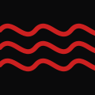
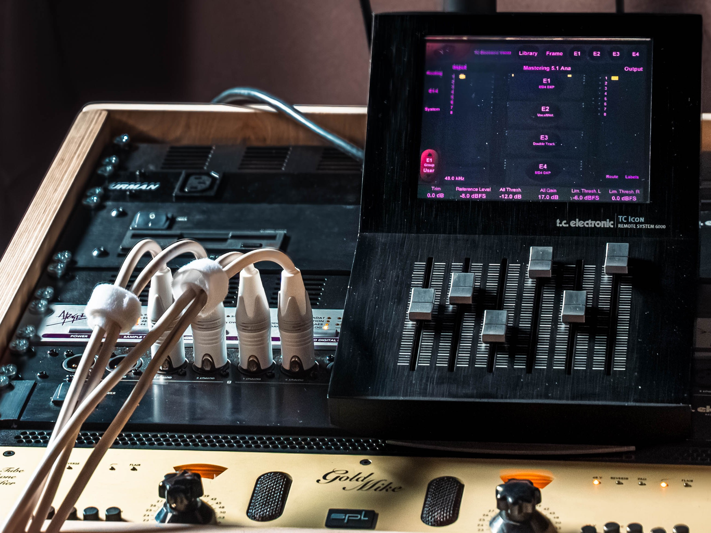

# YD Works — ydworks.de

## Проект
Персональный сайт аудио инженера Yegor Demchenko. Один файл index.html, деплой через Vercel + GitHub.

## Стек
- Чистый HTML/CSS/JS, ноль фреймворков
- Хостинг: Vercel (auto-deploy из main)
- Домен: ydworks.de (Porkbun)
- Репозиторий: github.com/ebymamash/ydworks-site

---

## Дизайн-система

```
--bg:   #000000
--text: #eeece8
--muted:#7a7875
accent-red:    #cc2020
accent-yellow: #c8a800
accent-blue:   #4a9eff
accent-green:  #4caf50
accent-grey:   #7a7875
```

- Шрифт везде: `'Lucida Console', 'Courier New', monospace` — Windows XP / 2005 era эстетика
- VT323 (Google Fonts) подключён но не используется в терминале
- Hero: hero.jpg — TC6000 + рэк, аниме стиль (Grok img2img), `object-fit: cover`, никакого grayscale
- Лого: logo.svg — три красных (#cc2020) синусоиды в квадрате, прозрачный фон, 80x80px
- CRT рамка: crt-frame.png — Sony Trinitron Multiscan E450, `mix-blend-mode: screen` (чёрные пиксели прозрачны)

---

## HTML-структура

```html
<nav>                          <!-- position:absolute, top-left hero -->
  <a href="#"></a>
</nav>
<a class="start-btn" id="start-btn">>Enter</a>   <!-- position:fixed, под лого -->
<div class="hero">
  
</div>
<div class="monitor-wrap">                        <!-- CRT секция -->
  <section id="terminal">
    <div id="term-wrap">
      <pre id="term-output"></pre><span id="term-cursor"></span>
    </div>
    <div id="term-footer">...</div>              <!-- юридика, position:absolute bottom -->
  </section>
      <!-- поверх терминала, mix-blend-mode:screen -->
</div>
```

---

## Ключевые CSS правила

```css
/* Кнопка Enter — фиксированная, под логом */
.start-btn {
  position: fixed;
  top: calc(1rem + 80px + 1.5rem);
  left: 1.5rem;
  width: 80px;
  font-size: 1.8rem;
  z-index: 10;
}

/* Монитор */
.monitor-wrap { position: relative; width: 100%; background: #000; z-index: 2; margin-top: -2px; }
.crt-frame { display: block; width: 100%; mix-blend-mode: screen; pointer-events: none; position: relative; z-index: 2; }

/* Терминал */
#terminal {
  display: flex; flex-direction: column; align-items: center; justify-content: flex-start;
  position: absolute; top: 0; left: 0; width: 100%; height: 100%;
  background: #000;
  padding: 21% 10% 3% 10%;        /* дефолт — интро */
  font-family: 'Lucida Console', 'Courier New', monospace;
  font-size: clamp(0.8rem, 1.4vw, 1.6rem);
  line-height: 1.4;
  overflow: clip;                  /* ВАЖНО: не hidden! hidden создаёт scroll-контейнер */
  overflow-anchor: none;           /* ВАЖНО: отключает scroll anchoring браузера */
  z-index: 1;
}
/* Три состояния padding-top через классы: */
#terminal.main-menu { padding-top: 30%; }   /* главное меню после возврата */
#terminal.submenu   { padding-top: 13%; }   /* [WHAT ARE YOU?] */
/* дефолт 21% = интро анимация и [ENTER CODE] тоже через .main-menu */

#term-wrap { width: auto; overflow-anchor: none; text-align: left; }
#term-output { white-space: pre-wrap; font-family: inherit; }

/* Курсор */
#term-cursor { display: inline-block; width: 0.6em; height: 1.1em; background: var(--text);
  vertical-align: text-bottom; animation: blink 0.8s step-end infinite; }

/* Стрелка навигации */
.menu-prefix.active { animation: arrow-glitch 1.1s step-end infinite; }
@keyframes arrow-glitch {
  0%,72%,76%,82%,100% { opacity: 1; }
  74%,78% { opacity: 0; }
}

/* Футер внутри терминала */
#term-footer {
  position: absolute; bottom: 3%; left: 10%; right: 10%;
  font-size: clamp(0.45rem, 0.7vw, 0.7rem);
  color: var(--muted); text-align: center; line-height: 1.6;
}

/* Мобайл */
@media (max-width: 768px) {
  .monitor-wrap { min-height: 100vh; overflow: hidden; }
  .crt-frame { position: absolute; top: 0; left: calc(50% - 66.67vh); width: 133.33vh; }
  #terminal { padding: 5%; }
  #term-wrap { width: 90%; }
}
```

---

## JS — архитектура

### Глобальные переменные
```javascript
let started = false;      // запущена ли сессия
let skipped = false;      // instant-режим (space после интро)
let introDone = false;    // закончилось ли интро
let typingGen = 0;        // генерация для отмены текущей анимации
const visitedSections = new Set();  // для fast-режима повторных посещений
let navItems = [];        // [{btn, prefixEl}] текущего меню
let navIndex = 0;
let inEnterCode = false;  // для Escape → [NO]
```

### Запуск
```javascript
if ('scrollRestoration' in history) history.scrollRestoration = 'manual';
window.scrollTo(0, 0);  // всегда hero при рефреше

function beginSession(scroll) {
  if (started) return;
  started = true;
  startBtn.style.display = 'none';
  if (scroll) monitorWrap.scrollIntoView({ behavior: 'smooth', block: 'end' });
  setTimeout(startTyping, 400);
}

// Скролл-триггер: когда кнопка >Enter доезжает до рамки монитора
function checkScrollTrigger() {
  const btnBottom = startBtn.getBoundingClientRect().bottom;
  const monitorTop = monitorWrap.getBoundingClientRect().top;
  if (monitorTop <= btnBottom) beginSession(false);
}
window.addEventListener('scroll', checkScrollTrigger, { passive: true });
startBtn.addEventListener('click', e => { e.preventDefault(); beginSession(true); });
```

### Анимация печати
- `startTyping()` — печатает introLines, charDelay:31ms, pauseDelay:246ms
- `typeText(text, container, callback, fast)` — печатает строку в DOM-узел
- Оба используют **catch-up механизм** через `Date.now()` (не requestAnimationFrame — работает в фоне)
- `typingGen` — инкремент отменяет текущую анимацию без kill таймера

### Клавиши
```
Enter (до старта)      → startBtn.click()
Enter (после интро)    → navItems[navIndex].btn.click()
↑ / ↓                  → setNavIndex()
Space (во время интро) → showFull() + мгновенный скролл
Space (после интро)    → skipped = true (всё последующее instant)
Escape (в ENTER CODE)  → showMainMenu()
```

### Меню — навигация
- `showMenu(sectionName, container, forceAnimate, fast)` — рендерит пункты
- `makeBtn(item)` — создаёт кнопку с цветными скобками и `span.menu-prefix`
- `setupNav(collected)` — вызывается после рендера меню, устанавливает navItems
- `setNavIndex(i)` — меняет текст prefix (`\n  > ` vs `\n    `) + класс `.active`
- `navigateTo(target, label, section, fast)` — echo + typeText + showMenu
- `handleClick()` — обрабатывает клик: `navItems = []`, затем логика навигации
- `showMainMenu()` — сброс в главное меню: `inEnterCode=false`, `.main-menu` класс, clearOutput

### Padding классы (JS-управление)
- `navigateTo`: `.remove('main-menu')`, если target==='WHAT ARE YOU?' → `.add('submenu')` иначе `.remove('submenu')`
- `handleEnterCode`: `.add('main-menu')`
- `showMainMenu`: `.remove('submenu')`, `.add('main-menu')`

---

## Контент терминала

### introLines
```
BOOTING...
LOADING SELF...
REASON FOR INTRUSION: UNKNOWN
RUNNING DIAGNOSTICS...
Diagnosis failed
DEFINING IDENTITY...
...
OH.
IDENTITY CONFIRMED: a GUEST
WHAT want you?
[пустая строка]
```

### Меню (sectionMenus)
- `intro`: [WHAT ARE YOU?, YD WORKS, MASTERING, COMMIT FILES, CONTACT, ENTER CODE]
- `main`: [YD WORKS, MASTERING, COMMIT FILES, CONTACT, ENTER CODE]
- `WHAT ARE YOU?`: то же что main (без WHAT ARE YOU?)
- `YD WORKS`: [AUDIO, DIGITAL, AI, OPERATOR, BACK→main]
- `MASTERING`: [WHAT IS MASTERING?, THE PROCESS, SPECS & DELIVERY, PRICING, BACK→main]
- `COMMIT FILES`, `CONTACT`: [BACK→main]
- Подпункты YD WORKS и MASTERING: [BACK→родитель]

### Цвета скобок кнопок
```
YD WORKS:     #cc2020 (красный)
MASTERING:    #c8a800 (жёлтый)
COMMIT FILES: #4a9eff (синий)
CONTACT:      #4caf50 (зелёный)
ENTER CODE:   #7a7875 (серый)
```

### Цвета подпунктов YD WORKS / MASTERING
AUDIO, DIGITAL, AI, OPERATOR, WHAT IS MASTERING?, THE PROCESS, SPECS & DELIVERY, PRICING — весь текст кнопки #c8a800

### ENTER CODE
```
ARE YOU UP TO SOMETHING?
> [input]
[NO]  [ENTER]
space click = animation skip
```
Неверный код: `INCORRECT. I AM WATCHING YOU.`
Верный код: скрытая страница — TBD, нужно минимум 2 кода

---

## Футер (внутри терминала)
```html
© 2025 Yegor Demchenko | Impressum | Datenschutzerklärung | Cookie-Richtlinie | Haftungsausschluss
```
Ссылки: /impressum /datenschutz /cookies /haftung — страницы ещё не созданы

---

## Бэклог
- [ ] Лого: стиль шрифта SONY через img2img (YD вместо SONY)
- [ ] Анимация hero image
- [ ] Страницы /impressum /datenschutz /cookies /haftung (наполнение)
- [ ] Минимум 2 рабочих кода в [ENTER CODE] → скрытая страница
- [ ] cv.html — секретная страница (CV + аниме девочка на TC6000), нигде не слинкована
- [ ] Easter egg: кодовое слово → cv.html
- [ ] Боковые маски на широких экранах — бегущий текст по бокам
- [ ] Кастомный курсор — мигающий прямоугольник DOS стиль

---

## Владелец
Yegor Demchenko, аудио инженер, Bielefeld DE
DD Mastering, Fritz Fey, Oberhausen
chudooyudoo@gmail.com
